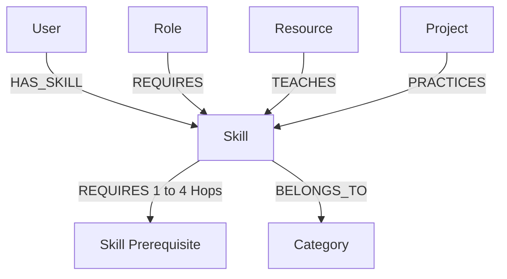

# PathGraph — CognoDB Graph Career & Learning-Path Explorer

> **Tagline:** Discover the shortest path from what you know to what you want to become.

PathGraph is a production-quality, full-stack web application backed by **CognoDB** (openCypher graph database running over the Neo4j Bolt protocol). It enables developers, career switchers, and engineering managers to model skills, analyze target role requirements, perform multi-hop graph traversals, and compute dependency-ordered learning paths.

---

## 1. Project Overview

Modern technical careers are not linear lists; they are deeply interconnected dependency graphs. A single target role like **Frontend Engineer** requires skills such as `React.js` and `TypeScript`, which themselves depend on `JavaScript`, which in turn depends on `Programming Fundamentals`.

PathGraph translates user capabilities and career aspirations into openCypher property graph queries, executing multi-hop traversals to calculate:
- **Missing Skill Gaps:** Graph-native set difference between user skills and role requirements.
- **Multi-Hop Prerequisite Trees:** Variable-depth graph traversal (`<-[:REQUIRES*1..4]-`).
- **Topological Learning Sequences:** Dependency-ordered step-by-step milestones.
- **Connected Resources & Projects:** Books, courses, and projects tied directly to missing nodes.
- **Interactive Graph Neighborhood:** 1-hop and multi-hop property graph exploration.

---

## 2. Why a Graph Database?

A traditional Relational Database Management System (RDBMS) represents entity links through Foreign Keys and Join Tables (`skill_prerequisites`, `role_skills`, `user_skills`). 

### Relational Schema Limitations vs. Graph Database Advantages

| Relational Approach (RDBMS) | Graph Database (CognoDB & openCypher) |
| :--- | :--- |
| **Variable-Depth Traversal:** Requires complex recursive Common Table Expressions (CTEs) or hardcoded SQL JOINs ($N$-level joins for $N$ depth), causing exponentially worsening query latency. | **Native Multi-Hop Path Matching:** Expressed naturally in Cypher as `(target:Skill)<-[:REQUIRES*1..4]-(prereq:Skill)`. Pointer hopping in CognoDB operates in $O(k)$ time relative to graph depth, not table size. |
| **Career Gap Matching:** Multi-table `LEFT JOIN` + `WHERE IS NULL` queries across 4+ tables (`users`, `user_skills`, `roles`, `role_skills`, `prerequisites`). | **Graph Set Difference:** Expressed cleanly in Cypher: `MATCH (r:Role {id: $roleId})-[:REQUIRES]->(req:Skill) WHERE NOT req.id IN $userSkillIds RETURN req`. |
| **Neighborhood Exploration:** Requires separate queries across every relational join table (`role_skills`, `resource_skills`, `project_skills`, `category_skills`). | **Relationship-Centric Pattern Matching:** A single Cypher query returns connected nodes across all relationship types (`REQUIRES`, `TEACHES`, `PRACTICES`, `BELONGS_TO`). |

### Concrete Real-World Example

To discover that `React` requires `JavaScript`, which requires `Programming Fundamentals`, a relational query requires multiple `JOIN` statements or a recursive SQL CTE. In CognoDB Cypher, this multi-hop traversal is a single declarative pattern:

```cypher
MATCH path = (target:Skill {id: 'react'})-[:REQUIRES*1..4]->(prereq:Skill)
RETURN path
```

---

## 3. Architecture

```text
               +--------------------------------------------------+
               |             Browser / React UI                   |
               | (Dashboard, Interactive Graph Canvas, Inspector) |
               +--------------------------------------------------+
                                        |
                                        v
               +--------------------------------------------------+
               |        Next.js App Router (JavaScript)           |
               |      API Routes (/api/path, /api/graph, etc.)   |
               +--------------------------------------------------+
                                        |
                                        v
               +--------------------------------------------------+
               |               Graph Service Layer                |
               |    (pathService, graphService, queries.js)      |
               +--------------------------------------------------+
                                  /            \
                                 /              \
                                v                v
       +---------------------------------+  +------------------------------+
       |   Official Neo4j Driver         |  |   Mock Graph Fallback Engine |
       |   (bolt+s://... Port 7687)      |  |   (Zero-config Reviewer Demo)|
       +---------------------------------+  +------------------------------+
                                |
                                v
       +---------------------------------+
       |  CognoDB Managed Cloud Database |
       |  (openCypher Property Graph)    |
       +---------------------------------+
```

---

## 4. Graph Data Model

The graph model uses 6 node labels and 6 typed relationships:

### Node Types & Key Properties

- `(:User)` — `id`, `name`
- `(:Role)` — `id`, `name`, `description`
- `(:Skill)` — `id`, `name`, `description`, `difficulty`
- `(:Category)` — `id`, `name`
- `(:Resource)` — `id`, `title`, `type`, `url`, `difficulty`
- `(:Project)` — `id`, `title`, `description`, `difficulty`

### Property Graph Schema Diagram (Mermaid)



## 5. Key Cypher Queries

All Cypher queries are strictly parameterized, stored in `cypher/queries.cypher`, and executed via `lib/cognodb/queries.js`.

### Query A — Required Skills for a Role
```cypher
MATCH (r:Role {id: $roleId})-[:REQUIRES]->(s:Skill)
OPTIONAL MATCH (s)-[:BELONGS_TO]->(c:Category)
RETURN s.id AS id, s.name AS name, s.description AS description, s.difficulty AS difficulty, c.name AS category
ORDER BY s.name
```

### Query B — Multi-Hop Prerequisite Traversal (2+ Hop Graph Traversal)
```cypher
MATCH path = (target:Skill {id: $skillId})-[:REQUIRES*1..4]->(prereq:Skill)
UNWIND nodes(path) AS n
WITH DISTINCT n
WHERE n.id <> $skillId
OPTIONAL MATCH (n)-[:BELONGS_TO]->(c:Category)
RETURN n.id AS id, n.name AS name, n.description AS description, n.difficulty AS difficulty, c.name AS category
```

### Query C — Career Gap Analysis (Missing Skills)
```cypher
MATCH (r:Role {id: $roleId})-[:REQUIRES]->(req:Skill)
WHERE NOT req.id IN $userSkillIds
OPTIONAL MATCH (req)-[:BELONGS_TO]->(c:Category)
RETURN req.id AS id, req.name AS name, req.description AS description, req.difficulty AS difficulty, c.name AS category
ORDER BY req.difficulty, req.name
```

### Query D — Resource & Project Pairing for Missing Skills
```cypher
MATCH (s:Skill) WHERE s.id IN $skillIds
OPTIONAL MATCH (res:Resource)-[:TEACHES]->(s)
OPTIONAL MATCH (proj:Project)-[:PRACTICES]->(s)
RETURN s.id AS skillId,
       collect(DISTINCT { id: res.id, title: res.title, type: res.type, url: res.url }) AS resources,
       collect(DISTINCT { id: proj.id, title: proj.title, description: proj.description }) AS projects
```

### Query E — 1-Hop Graph Neighborhood Exploration
```cypher
MATCH (center:Skill {id: $skillId})
OPTIONAL MATCH (center)-[:REQUIRES]->(prereq:Skill)
OPTIONAL MATCH (dependent:Skill)-[:REQUIRES]->(center)
OPTIONAL MATCH (role:Role)-[:REQUIRES]->(center)
OPTIONAL MATCH (resource:Resource)-[:TEACHES]->(center)
OPTIONAL MATCH (project:Project)-[:PRACTICES]->(center)
RETURN center, collect(DISTINCT prereq) AS prerequisites, collect(DISTINCT dependent) AS dependentSkills, collect(DISTINCT role) AS requiredByRoles, collect(DISTINCT resource) AS learningResources, collect(DISTINCT project) AS practiceProjects
```

---

## 6. Local Setup & Seeding Instructions

### Step 1: Clone Repository & Install Dependencies
```bash
git clone <repository-url>
cd pathgraph
npm install
```

### Step 2: Configure Environment Variables
Copy `.env.example` to `.env`:
```bash
cp .env.example .env
```

Edit `.env` with your CognoDB instance credentials:
```env
COGNODB_URI=bolt+s://your-instance.cognoDB.cloud:7687
COGNODB_USERNAME=cognodb
COGNODB_PASSWORD=your_secure_password
```

> **Note:** If CognoDB credentials are not configured, PathGraph automatically runs in **Mock Graph Fallback Mode**, allowing instant demonstration out of the box!

### Step 3: Seed the Database
Run the idempotent Node.js seed script to load schema constraints (`cypher/schema.cypher`) and the seed dataset (`cypher/seed.cypher`):
```bash
npm run seed
```

### Step 4: Start Development Server
```bash
npm run dev
```
Open [http://localhost:3000](http://localhost:3000) in your browser.

---

## 7. Environment Variables

| Variable | Required | Description | Example |
| :--- | :--- | :--- | :--- |
| `COGNODB_URI` | Yes (for live DB) | CognoDB Bolt Connection URI | `bolt+s://xxxx.cognoDB.cloud:7687` |
| `COGNODB_USERNAME` | Yes | Database User | `cognodb` |
| `COGNODB_PASSWORD` | Yes | Database Password | `••••••••` |

---

## 8. Reviewer Demo Guide (2-Minute Test Flow)

1. Open **PathGraph** at `http://localhost:3000`.
2. Notice the **Database Status Badge** in the header (`CognoDB Active` or `Mock Graph Mode`).
3. Select current skills: `JavaScript`, `Git`, `HTML5 & Modern CSS`, `Programming Fundamentals`.
4. Select target role: `Frontend Engineer`.
5. Click **Build My Learning Path**.
6. View the summary banner: `4 of 6 skills matched (67% match) — 2 skills to develop`.
7. Observe the step-by-step topological progression:
   - **Step 1:** Learn `TypeScript` & `React.js`
   - **Step 2:** Learn `Frontend Testing`
   - Linked documentation (`React Official Docs`, `TypeScript Handbook`) and practice projects.
8. Click **Explore Graph Neighborhood** on any skill to inspect 1-hop and multi-hop prerequisites in the interactive inspector modal.
9. Navigate to **Graph Explorer** (`/explore`) to interact with the full property graph visualization canvas.

---

## 9. Testing

Run unit tests verifying path calculation, topological sorting, and graph formatting:
```bash
npm test
```

---

## 10. Technical Decisions & Engineering Trade-offs

1. **Official Neo4j JS Driver (`neo4j-driver`):** We use the official `neo4j-driver` over custom SDKs to ensure maximum compatibility with Bolt 5.0 protocol and connection pooling.
2. **Server-Side Database Isolation:** Database access logic is restricted strictly to Next.js API routes and server services (`lib/cognodb/queries.js`). No database credentials or driver instances are exposed to the browser client.
3. **Out-of-The-Box Mock Fallback:** To give reviewers a seamless experience even before setting up a cloud CognoDB instance, we implemented an in-memory graph engine (`lib/cognodb/mockData.js`) that mimics Cypher query execution when environment variables are omitted.
4. **Pure JavaScript (ES6+ / JSX):** Standard JavaScript codebase cleanly organized for readability, fast iteration, and straight-forward interview code review.

---

## 11. License

MIT License — Built for the Wexa AI Graph Database Take-Home Assignment.
